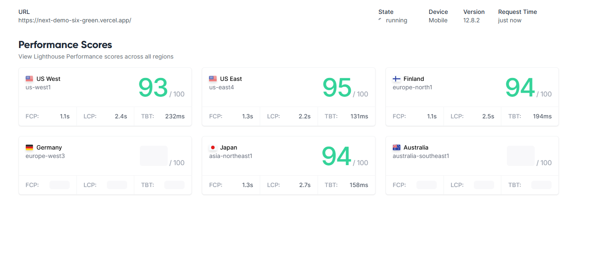
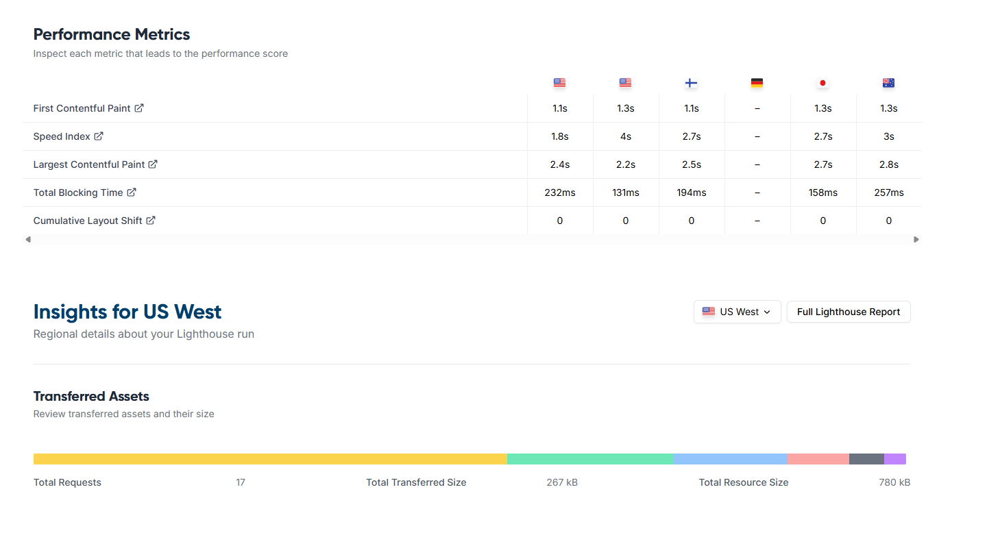
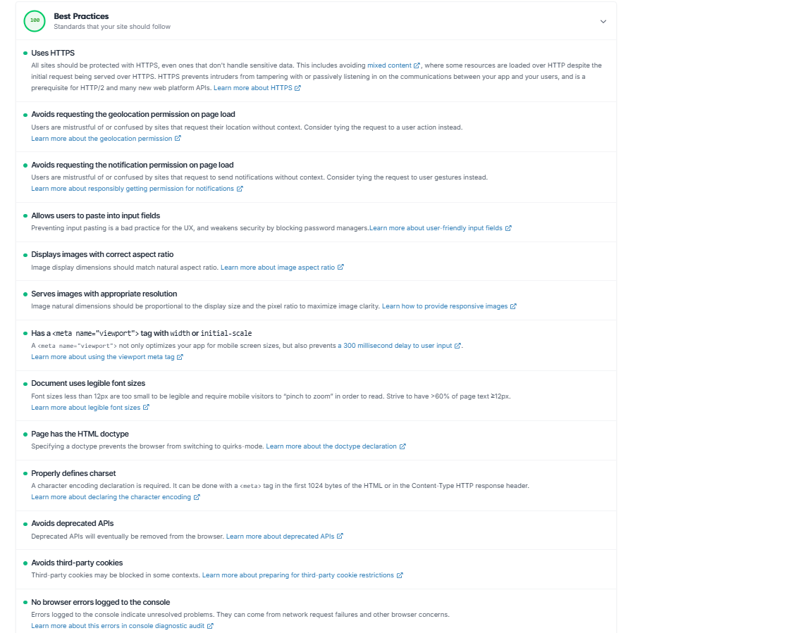
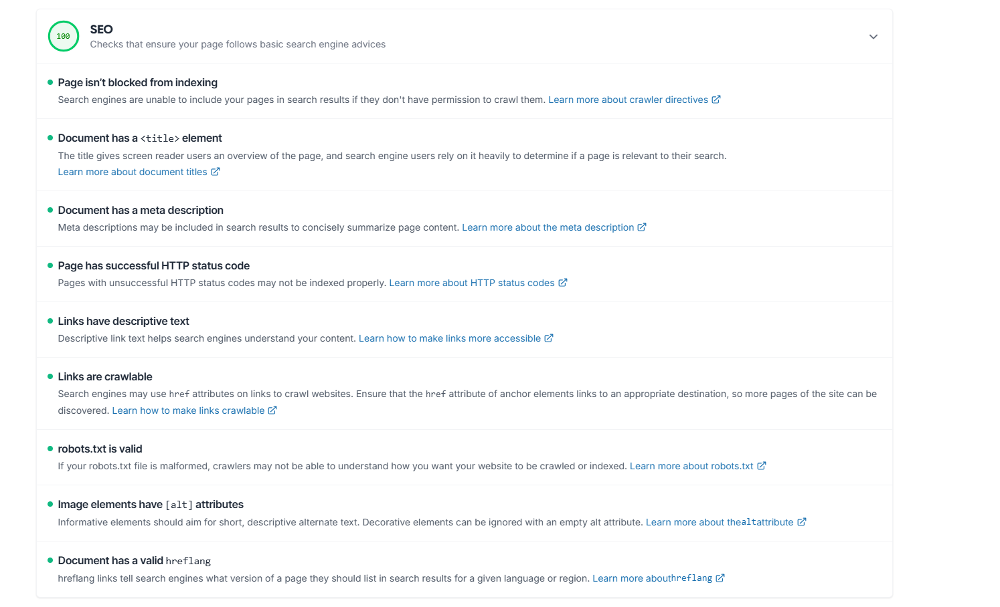

# Tech Insights Hub

A fast, SEO-optimized tech blog built with Next.js App Router, TypeScript, and Tailwind CSS. It fetches 10 posts from the Sling Academy sample API and provides combined search + category filtering with an accessible article modal.

## Live Links

- GitHub repo: https://github.com/kausik11/next-demo.git
- Vercel deployment: https://next-demo-six-omega.vercel.app/

## Tech Stack

- Next.js 16 (App Router)
- React 19
- TypeScript
- Tailwind CSS v4

## Getting Started

```bash
npm install
npm run dev
```

Create a production build:

```bash
npm run build
npm run start
```

## Environment Variables

Set the base URL for sitemap and metadata:

```
NEXT_PUBLIC_SITE_URL= hhttps://next-demo-six-omega.vercel.app/
```

## Lighthouse Audits

Screenshots are stored in `screenshots/` and referenced below. Replace these placeholder files with your actual Lighthouse captures after running the audit locally.

- Performance



- Accessibility



- Best Practices



- SEO



## SEO Strategy

- Meta tags: `metadata` on the homepage includes `title` + `description` along with Open Graph and Twitter Card fields for rich previews and consistent SERP snippets.
- Semantic HTML: The page layout uses `<header>`, `<main>`, `<section>`, `<article>`, `<nav>`, `<footer>`, and `<time>`, with a single H1 to keep hierarchy clear.
- Image optimization: All images use `next/image` with responsive `sizes`, descriptive `alt` text, and default lazy-loading for non-critical imagery; the hero image is prioritized to improve LCP.
- Performance optimizations: Data is fetched on the server with ISR (`revalidate: 3600`), client filtering is memoized, and article cards are progressively revealed via an `IntersectionObserver` to reduce initial rendering work.
- Structured data: JSON-LD for WebSite and Article entities is rendered on the homepage for rich results eligibility.
- Technical SEO: `robots.txt` and `sitemap.xml` are emitted via App Router metadata routes with normalized, absolute URLs.

## Search and Filter Implementation

- The search input matches against `title`, `description`, and `content_text` using a normalized lower-case compare.
- Categories are derived from unique post values, with an `All` option to reset filtering.
- The final list is computed in a memoized selector, then lazily revealed in chunks to keep UI interactions fast.

## Accessibility & UX

- Keyboard navigation: cards are focusable and open on Enter; ESC closes the modal; focus returns to the last active element.
- Modal semantics: `role="dialog"`, `aria-modal`, and labeled title/description.
- Color contrast meets WCAG AA on primary text elements.

## Challenges / Notes

- The API returns external image URLs, so `next.config.ts` allows the Sling Academy host via `remotePatterns`.
- If the API is unavailable, a friendly error state is shown on the homepage.
-The URL structure is currently homepage-only.

## Project Decisions

- The UI is built with Tailwind CSS for fast iteration and consistent spacing.
- Server components fetch data, while a focused client component handles search, filter, and modal behavior.

## Technologies Used

- Next.js 16 (App Router)
- React 19
- TypeScript
- Tailwind CSS v4
- ESLint

## Assumptions

- Search is client-side only, so the `SearchAction` schema points to a query string even though it is not currently parsed.

